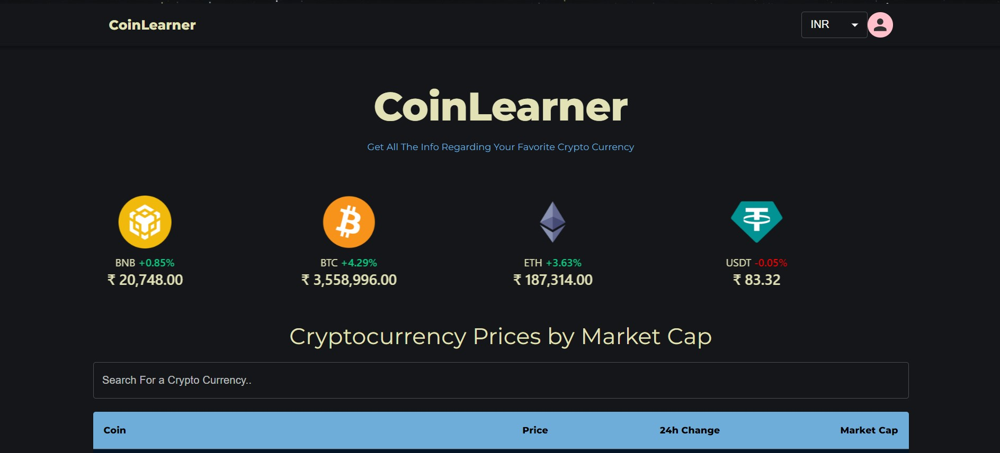
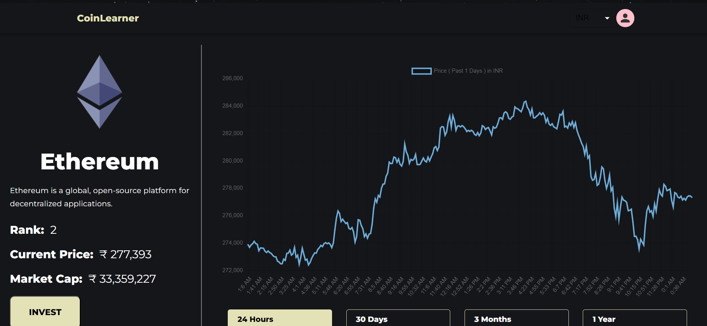

# CRYPTO HUNTER

Designed and developed a sophisticated application to provide real-time cryptocurrency prices and facilitate
market simulation for educational purposes.
- Real-Time Price Display: Provides up-to-date prices for various cryptocurrencies.
- Historical Price Graphs: Visualizes historical price trends using graphs to aid in market analysis.
- Market Simulation: Enables risk-free buying and selling simulations for learning purposes.

## Libraries Used
- Express JS - for RESTful APIs
- MySQL - for database and queries
- Material UI v4 - for UI
- Google Firebase - for Authentication
- API from coingecko - for getting crypto currency informations

## Functionality
- Real-Time Price Display: Display the current prices of various cryptocurrencies in real-time.Show price changes over different intervals (e.g., hourly, daily).

- Historical Data Visualization: Provide interactive graphs showing the price trends of cryptocurrencies over the last 10 years.Allow users to select specific time frames (e.g., 1 month, 1 year, 5 years) to view price trends.

- Simulated Trading Environment:  Allow users to simulate buying and selling cryptocurrencies using virtual currency.Provide a user-friendly interface for executing trades.Display transaction details and confirmation messages after each trade.

- Portfolio Management: Show the user's current portfolio, including the number of coins held and their current value. Update the portfolio in real-time based on market prices and user transactions.

- Transaction History: Keep a record of all user transactions (buy/sell) and display them in an easy-to-read format. Allow users to filter and search their transaction history.

- User Registration and Login: Allow users to create an account using email and password.Implement secure authentication mechanisms to protect user data.

## Screenshots

### Home Page

### Currency info Page

### User investments tab

### User History tab

## Authors

- [@Ashwin D](https://github.com/Ashwin-codess).

